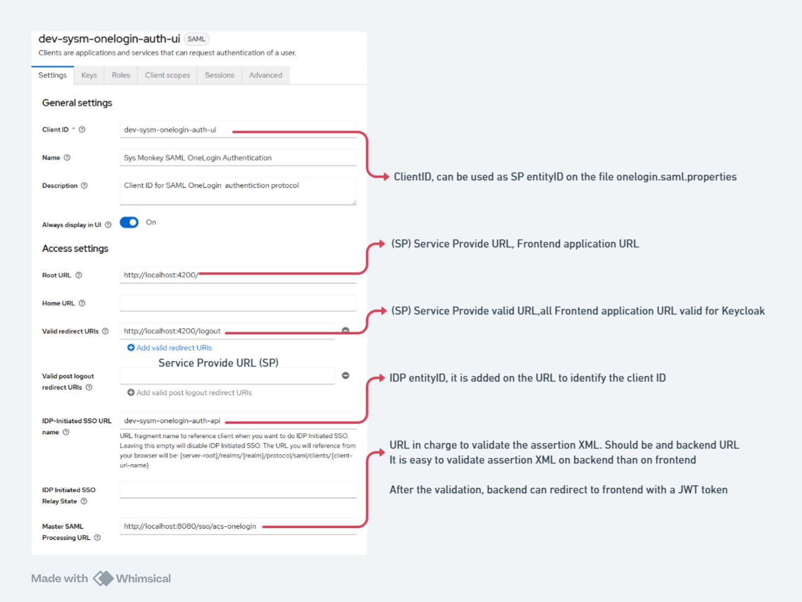
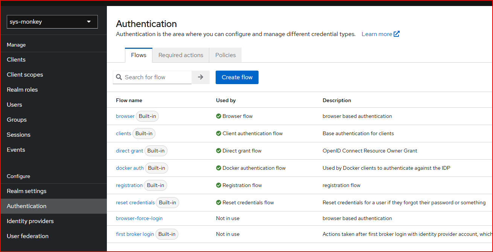
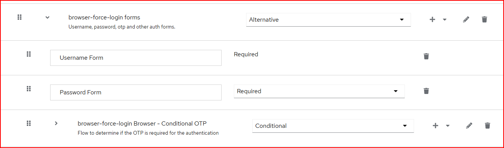
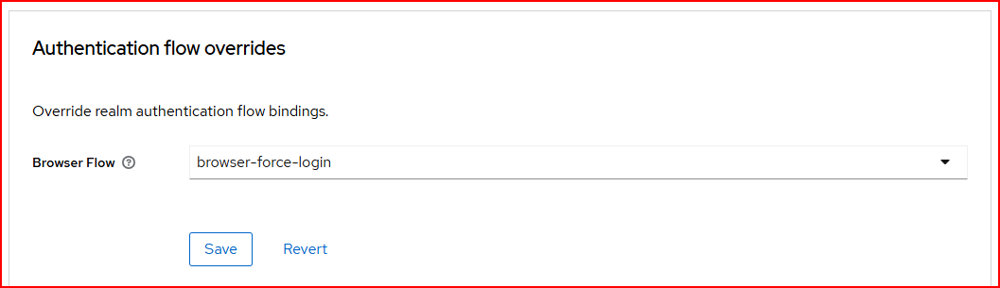

## Basic Keycloak SAML Configuration

SP Service Provider is the application that is requesting authentication from the Identity Provider (IdP). 
The SP is responsible for initiating the SAML authentication request and handling the SAML response.

IdP Identity Provider is the entity that provides authentication services to the SP.

ACS Assertion Consumer Service is the URL where the IdP sends the SAML response after the user has authenticated.

This example is a Spring Boot application that expose an endpoint to receive the SAML response.
And validade the assertion XML, after that a JWT token is generated and redirected to Web Angular application.

> Web Angular application is SP, and Spring Boot application can be considered as SP too.
> 
>The Keycloak server is the IdP.

### Bellow is the configuration of the Keycloak SAML client:

## keycloak does not provide a way to make logout
To make the user log out, I created a custom Authentication Flow in Keycloak that forces the user to re-enter their credentials.
## keycloak does not support force authn in SAML

To make the user re-authenticate, I created a custom Authentication Flow in Keycloak that forces the user to re-enter their credentials.

This flow can be triggered by setting the "force" parameter to "true" in the SAML request. The custom flow can be created by following these steps:

1. Log in to the Keycloak admin console.
2. Navigate to the "Authentication" section.
3. Click on "Flows" and create a new flow.
4. Duplicate the "browser" flow and name it something like "browser-force-login".
5. On the step browser-force-login forms, delete the step Username Password Form.
6. Add the following steps:
   - "Username Form" (this will be the first step)
   - "Password Form" (this will be the second step)
7. Disable the Cookie step and Identity Provider Redirector step.
   - This will make the flow only use the Username and Password forms.
8. Go to your client settings on the advanced tab and set the "Authentication Flow" to the new flow you created.
   - on the area "Authentication Flow Overrides" set the "Browser Flow" to the new flow you created.

## Validation assertion XML
This project has two ways to validate the assertion XML:

1. Class one SAMLOneLogin.
   Using the java onelogin saml library. This library provides methods to validate the assertion XML.
   It is provided to library the request and response, and the library extracts the assertion XML, and does all the validation.

2. Class two SAMLValidator
   Using the java opensaml library. This library helps to validate the assertion XML.
   It is used to validate the signature of the assertion XML.
   My onw code does all the assertion, checking the expiration date, and the audience and so on.
